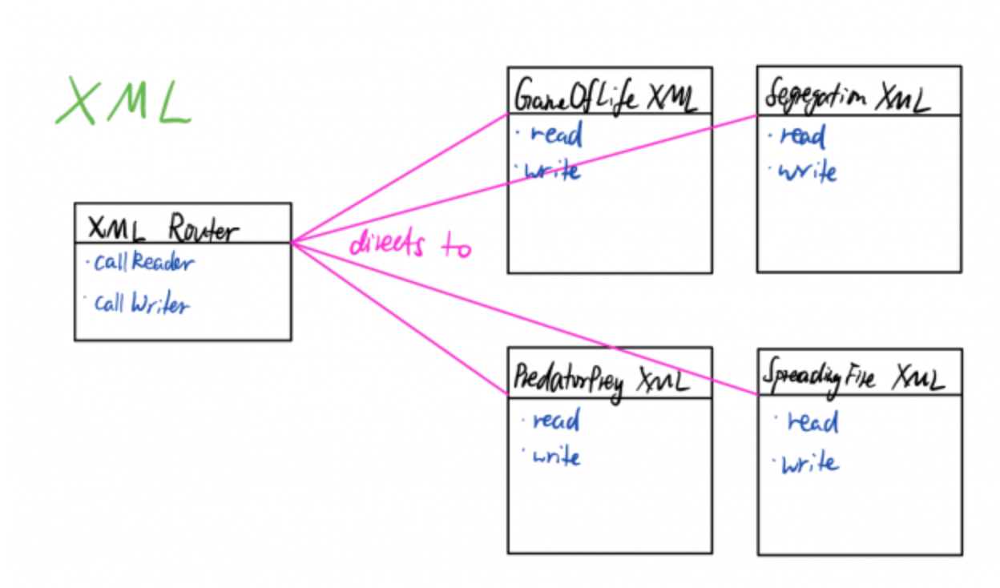
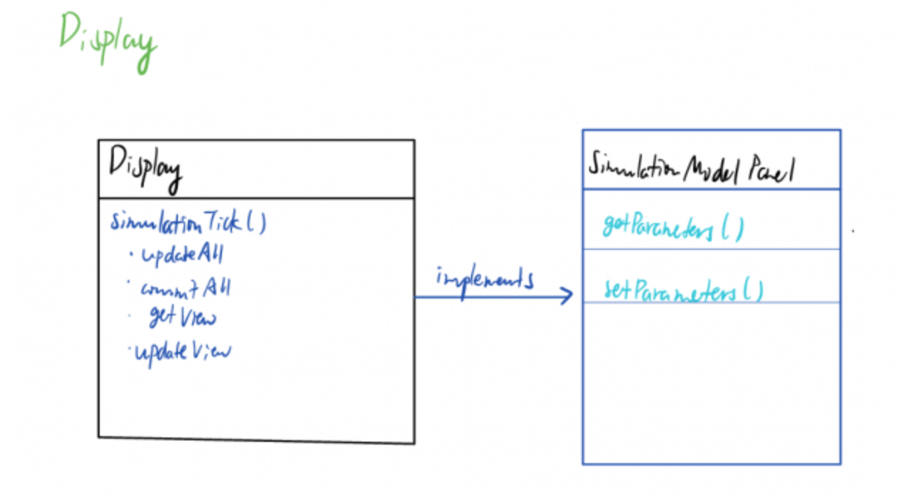

CompSci 308: Cell Society Analysis
===================

> This is the link to the assignment: [Cell Society](https://coursework.cs.duke.edu/CompSci308_2018Fall/cellsociety_team10)


Design Review
=======

### Overall Design

##### Describe the overall design of the complete program:

* What is the high level design of each part (Simulation, Visualization, and XML)?
    * Simulation
        * Cell.java initializes cells with multiple values, such as coordinate, height/width, shape, and the value for the next stage
        * CellGraph.java is a customized HashMap containing all the cells as the key, and each cell's neighbors as the value. It is designed this way to flexibly display different shapes and structure of the cells. 
        * Simulator.java manages the CellGraph that contains all the individual cells. It performs a tick method to update the all cell's value, update the color of the cells that will be rendered to the GUI. It handles the change of the cell shape or the simulation model. It also communicates between the model and the GUI. For instance, it retrieves the statistics from a model and return that information to the GUI for it to draw a line chart.
        * models
            * Contains four models: Game Of Life, Spreading Of Fire, Segregation, Wa-Tor
            * The models all implement the SimulationModel interface, which specifies the methods for each model.
            * We use an interface because there are always some minor differences between models. For example, Segregation Model requires global update while others do not. Therefore, we specify a method named globalUpdate for the cells to move around in the entire CellGraph. Besides, each model contains different model parameters, thus we are supposed to use an interface to ensure the uniformity while allowing the existence of differences.
            * Each model is able to update cell value, update model parameters, update color, retrieve statistics of the current model (such as the number of each type of the cell), and call an XML writer to generate an XML file.
        * factory
            * Contains simulator generator for each model
            * Generates a simulator for a corresponding model based on the shape of the cell, with/without boundary, and the specific parameters to a model
            * The shapes that are available now are rectangle and triangle. However, it will be fairly easy to add other shapes, as the design now is pretty adaptable.
    * Visualization
        * Main.java starts the animation in the GUI
        * GUI.java displays four components: SimulationControl, ModelChart, ModelControl, SimulationPanel
            * SimulationControl manages the modelControl (i.e. update the model) and the modelChart (i.e. update the line chart), and the modelControl manages simulationPanel (i.e. update the parameters for the existing model).
        * SimulationControl.java is the bottom part of the GUI. The user will be able to load/save settings from XML file, start/pause the simulation, change the rate of simulation, change the model, or change the cell shape.
        * model_controls
            * Contains sliders to allow users to change the parameters specific to each model.
            * Each model contains different number of parameters and names of the parameters, except the cell number is the common parameter. Thus I chose to use an abstract class that contains a slider for the cell number. In this way, I avoid duplicated code for cell number slider in each modelControl
        * statistics
            * ModelStatistics is an abstract class of a line chart. It contains the information about the axis, but does not have any information about the series in the chart.
            * Each model has their corresponding statistics class, which provides the abstract with series for each model.
            * Each model has a method updateStatistics, which will be called each time the new statistics is retrieved in the SimulationControl
    * XMl
        * parsers
            * ParentXMLParser.java is an abstract class which outlines what the children class need to perform
            * By using an abstract class, we are able to reduce the amount of the duplicated code from each parser
            * parsers that are specific to each model parse different parameters and allow the GUI to retrieve the values and render
        * writers
            * XMLWriter.java is an abstract class which outlines what the children class need to perform
            * By using an abstract class, we are able to reduce the amount of the duplicated code from each writer
            * writers that are specific to each model create tags for each parameters in the model and allow the user to save the new XML file to the local directory
        * XMLException
            * Throws exceptions when an XML error occurs

* What is needed to add a new kind of simulation to the project (describe all parts of the code or resources that need to be changed to recognize new XML tags and new Java automata rules)?
    * Simulation
        * New model needs to be added into models folder. It should include the specific parameters to the model and the rule of the model
        * New model's generator needs to be added into the factory. It should allow multiple ways to randomly generate a simulation
    * Visualization
        * New model's specific parameters need to be added into model_controls package, which creates sliders for each parameter
        * New model's roles need to be added to statistics package to display the number of each role on the line chart
    * Configuration
        * Need to create a child XML parser for the new model that extends ParentXMLParser
        * Need to create a child XML writer for the new model that extends XMLWriter. Specific tags need to be added for each parameter.
    * resources
        * Add the model name in English into English.properties

* Are the dependencies between the parts clear and easy to find (e.g., public methods and parameters) or do they exist through "back channels" (e.g., static calls, order of method call, requirements for specific subclass types)? 
    * There are plenty of dependencies in each class, as the three parts are connected to each other.
    * Overall, there are 96 entries in Library Class, and 85 entries in the Production class
    * The dependencies are easy to find, especially in the environment of IntelliJ. For example, SimulationPanel uses the dependency from Simulator from simulation package. The GUI is in charge of displaying the real-time simulation to the user, and it needs to depend on the rules and the models of the simulation. Thus, it will need simulator as the dependency.

##### Read over and describe one of the components that you did not implement:
* What makes it readable or not (i.e., do classes and methods do what you expect and have logic that is clear and easy to follow)? Give specific examples.
    * ParentXMLParser.java is not very readable.
    * Firstly, it does not have sufficient comments, thus it will take me a while to infer what these methods will do.
    * Secondly, a lot of methods are clumped together. A lot of methods such as getCellGraphFromLayout and graphFromProbs are longer than 20 lines include multiple loops.
    * Thirdly, the class is very long, which exceeds 300 lines, and the enormous number of methods are a little bit of confusing.
    * However, the naming of the constants and the variables are very concise and accurate. Thus it is easy for me to understand.
* What makes it encapsulated or not (i.e., can the implementation be easily changed without affecting the rest of the program)? Give specific examples.
    * It is fairly well-encapsulated. If I am going to add a model, I can just create a child class for the XML parser and writers that contain specific parameters for the model, which is only around 50 lines. Thus, it is pretty flexible.
    * However, if I am going to modify the parent class, it will be confusing to find which part I am looking for. For example, if I am going to add the shape tag to the XML file, I need to understand where to place it. I wish there is a method that contains calls all the methods sequentially to create tags for the XML file. 
* What have you learned about design (either good or bad) by reading your team mates' code?
    * I learned about good design by reading Inchan's code. He has a good understanding of the design and came up with the general design for our project. For example, initially we only had Cell and CellGraph, but later on we added simulator to control the action and states of Cell. Here, simulator acts like a Controller which communicates with the GUI. The Cell and CellGraph are like the model that contain the specific simulation model.
    * I also learned about how to use an abstract class. I only used interface before, but when I was working on the GUI, I realized abstract class is more suitable here. By looking at Inchan's XMLWriter, I learned imitated him to write ModelControl and ModelStatistics.

##### Is the total code generally consistent in its layout, naming conventions and descriptiveness, and style? Give specific examples for or against by comparing code from different team members.
* The code is generally consistent in layout
    * We have gathered classes under the same package if they have similar functionalities.
    * For example, factory folder contains GameOfLife, NeighborUtils, Segregation, SpreadingFire, and WaTor. statistics folder contains GameOfLifeStatistics, ModelStatistics, SegregationStatistics, and WaTorStatistics
* The code is generally consistent in naming conventions and descriptiveness
    * For the class names, we use the folder name as the suffix for each class, and the model name fot the prefix
    * For the constant names, we use readable, concise, capital letters to represent.
    * For the variable names, we use camel case and readable names.
    * For the method names, we also use camel case with the first word being a verb. We try to make the method name as descriptive as possible. For example, in SimulationControl, we have initializeElements(), tick(). In SegregationWriter, we have encodeCellValue(). For the Simulator, we have updateView();
* The code is generally consistent in style except in the syntax
    * Inchan has an advanced understanding of new Java syntax, so he takes advantage of some advanced tertiary statement, map, filter, forEach, etc. He also uses <T> to represent ambiguous object, and I did not use this concept.
    * For example, here is Inchan's code
        ```java
        public List<Cell<T>> getOrderedCells(SimulationModel<T> model) {
            return keySet().stream()
            .sorted(Comparator.comparingInt(c -> model.updatePriority(c.value())))
            .collect(Collectors.toList());
        }
        ```
    * My code
        ```java
            public void handleParamChange() {
                var pack = new HashMap<String, String>();
                pack.put(SegregationModel.PARAM_SATISFACTION, Double.toString(thresholdBar.getValue()));
                simPanel.simulator().updateSimulationModel(pack);
            }
        ```

### Your Design

##### Describe how your code is designed at a high level (focus on how the classes relate to each other through behavior (methods) rather than their state (instance variables)).
* I am primarily in charge of visualization
* **Main.java** starts the animation in the GUI. 
* **GUI.java** initializes four components: SimulationControl, ModelChart, ModelControl, SimulationPanel. It contains a step() method. When we know the simulation should be updated, the pane will clear itself and add the updated panels onto the pane again and display them.
    * SimulationControl manages the modelControl (i.e. update the model) and the modelChart (i.e. update the line chart), and the modelControl manages simulationPanel (i.e. update the parameters for the existing model).
* **SimulationControl.java** is the bottom part of the GUI
    * The user will be able to load/save settings from XML file, start/pause the simulation, change the rate of simulation, change the model, or change the cell shape. Once the cell shape or the model change, the entire simulation will be cleared out and a new one will replace the current simulation.
    * tick() updates the models. It keeps a internal timer to tick once in simPeriod. It also updates the line chart when the model updates.
* model_controls
    * Contains sliders to allow users to change the parameters specific to each model.
    * **ModelControl.java** is an abstract class that extends VBox. It contains a slider to adjust the cell number and allow the SimulationPanel to update the model. Three methods within it interact with the SimulationPanel to change the simulation: handleNumCellChange() and handleParamChange(), handleNeighborChange(). 
    * **GameOfLifeControl.java**, **SegregationControl.java**, **SpreadingFireControl.java**, and **WaTorControl.java** contain sliders that allow users to change the parameters for specific models. 
* statistics
    * **ModelStatistics.java** is an abstract class that extends a line chart. It contains the information about the axis, but does not have any information about the series in the chart. It specifies a method updateStatistics() for the line chart to update itself.
    * **GameOfLifeStatistics.java**, **SegregationStatistics.java**, **SpreadingFireStatistics.java**, and **WaTorStatistics.java** specify the specific parameters in the updateStatistics() method, which uses the parameter name as the key to retrieve data from the model in Simulation.

##### Discuss any remaining Design Checklist issues within you code (justify why they do not need to be fixed or describe how they could be fixed if you had more time). Note, the checklist tool used in the last lab can be useful in automatically finding many checklist issues.
* Communication
    * In some one-line if statement, there is no brackets. This is too minor to be fixed and does not affect the readability of the code
    * Some magic values still exist in simulation models
* Flexibility
    * Some methods' return type should be more general, unless we are using a specific method contained only in the specific data structure. For example, in ParentXMLParser.java, methods cellValsFromProbs() and cellValsFromList() both return ArrayList instead of List. 
* Modularity
    * Specific XYSeries should be private instead of public. They should be treated as constant because they do not need to communicate with other classes and should not allow to be changed.
* Code Smells
    * No issues as the checklist tool suggests.
* Java Notes
    * In classes such as Segregation and GameOfLife, we used public constructors. As the checklist tool suggests, it might be better to use private constructors instead.
    * While throwing exceptions in XML writer and parser, maybe it will be better if we log the exception using logger.error("Error", e).

##### Describe two features that you implemented in detail — one that you feel is good and one that you feel could be improved:
* First feature (Good): ModelControl Panel that is on the left part of the GUI
    * Justify why the code is designed the way it is or what issues you wrestled with that made the design challenging.
        * I started constructing the GameOfLifeControl using a VBox that contains a slider. Then I realized that there are multiple models with different parameters. Therefore, after discussing with Inchan, I decided to use an abstract class to create ModelControl for each model. 
        * However, at that time I was not very familiar with abstract class. I even tried to initialize the ModelControl class in the SimulationControl, and it was rejected by Java. Then I changed the abstract class to an interface to specify the methods that each control panel needs to implement. But in that case, after multiple trials, I realized when the model is changed, I had to erase the corresponding model panel and initialize a completely different model panel. Therefore, I changed ModelControl back to an abstract class and experimented on that. Eventually, I realized the advantage of using an abstract class, because in this case I just need to initialize ModelControl once, and I can control and display its children classes. This proves the powerfulness of flexible design.
    * Are there any assumptions or dependencies from this code that impact the overall design of the program? If not, how did you hide or remove them?
        * I try to keep the number of dependencies at the minimum. ModelControl depends on Simulator, because it needs to initialize a new simulator when the parameter changes. However, when there are changes in Simulator class, there is no need to change the ModelControl class.

* Second feature (Need improvement): SimulationControl that controls multiple parameters for the simulation
    * Justify why the code is designed the way it is or what issues you wrestled with that made the design challenging.
        * SimulationControl is on the top of the hierarchy. It manages the modelControl (i.e. update the model) and the modelChart (i.e. update the line chart), and the modelControl manages simulationPanel (i.e. update the parameters for the existing model).
        * This class is designed this way because it needs to communicate with nearly all other classes in GUI. The complex interaction makes SimulationControl depend on many packages, though they are almost all internal.
        * The code in this class is very condense. It has over 300 lines, and I think it can possibly be separated to emphasize the functionality of each part.
    * Are there any assumptions or dependencies from this code that impact the overall design of the program? If not, how did you hide or remove them?
        * SimulationControl has a lot of dependencies.
            * All the models
            * All the model_controls
            * All the statistics
            * All the XML parsers
            * XML Exception
        * I tried to use as few dependencies as possible. However, in this case, it is unavoidable to use these dependencies, because the SimulationControl is like the master engine for the simulation.

### Flexibility

###### Describe what you think makes this project's overall design flexible or not (i.e., what new features do you feel it is able to support adding easily).
* Our overall design is very flexible for several reasons
    * The three different parts are separated, and in each part, there are separate parts with different functions. Within each part, classes with similar functionalities are put together for adding new features easily.
    * Although if someone is going to add a new model, he or she must go into multiple folders and add multiple files. This can be confusing for someone who is new to this project. However, in this way it is more organized thus easier to debug.

###### Describe two features from the assignment specification that you did not implement in detail (these can overlap the previous ones but must be discussed from this different perspective):
* First Feature: The feature is achieved from the code in the neighbor_chooser folder
    ```java
    public class NeighborChooser extends Dialog<List<Pair<Integer, Integer>>> {
    private NeighborChooserPane dialogPane;
    public NeighborChooser(String shapeType) {
        dialogPane = new NeighborChooserPane(shapeType);
        setDialogPane(dialogPane);
        setResultConverter(e -> {
            if(e.getButtonData().isCancelButton()) return null;
            else return dialogPane.getChosenIndices();
            });
        }
    }
    ```
    * What is interesting about this code (why did you choose it)?
        * This code is interesting because it allows the user to be able to choose which cells surrounding one cell as neighbor(s).
        * It extends DialoguePane and truly makes it interactive for the user to choose neighbors by clicking on the 3\*3 graph. 
    * What classes or resources are required to implement this feature?
        * It needs ShapeUtils.java from simulation folder
        * It also needs the MOUSE_ENTER_OPACITY variable from the simulator to keep the opacity the same when the mouse is hovering above the cell.
    * Describe the design of this feature in detail (what parts are closed? what implementation details are encapsulated? what assumptions are made? do they limit its flexibility?)
        * The NeighborChooser is closed. It only contains a NeighborChooser as a private field.
        * Within NeighborChooserPane, initializeTriangle() and initializeRectangle() are closed. They are private methods that help initialize a neighbor grid. Also, the fields within IndexedShape.java are all private.
        * The initializer for NeighborChooser is open. It is called from ModelControl to set up the NeighborChooser as a Dialog Panel.
    * How extensible is the design of this feature (is it clear how to extend the code as designed? what kind of change might be hard given this design?)
        * I think the design of this feature is relatively extensible. The code is separated into three classes to implement this feature. For example, if we have added a new shape like a hexagon, we can just directly add a method named initializeHexagon()

* Second feature: the feature is achieved from ColorUtils.java and from utility folder
    ```java
    public static Color mix(Color a, Color b, double pA) {
        double red = a.getRed()*pA + b.getRed()*(1-pA);
        double green = a.getGreen()*pA + b.getGreen()*(1-pA);
        double blue = a.getBlue()*pA + b.getBlue()*(1-pA);
        return new Color(red, green, blue, 1);
    }

    public void handleClick(SimulationModel<T> model) { value = model.nextValue(value); updateView(model); }
    ```
    * What is interesting about this code (why did you choose it)?
        * It is interesting because it mixes two colors on the GUI and makes the simulation more interactive. When a user hovers the mouse above a cell, the cell's color will turn into the color of its counterpart. Once the user clicks on the cell, the color then turns into the counterpart. This is particularly interesting because it makes the simulation fun and allow the user to change the type of the cell.
    * What classes or resources are required to implement this feature?
        * It requires Color package from Java and an Event handler to handle button hovering and clicking.
    * Describe the design of this feature in detail (what parts are closed? what implementation details are encapsulated? what assumptions are made? do they limit its flexibility?)
        * The mix method is static so it is closed. It does not allow other classes to change it. It only takes in two colors and mix them together. It allows to be called by cell in the simulation panel.
    * How extensible is the design of this feature (is it clear how to extend the code as designed? what kind of change might be hard given this design?)
        * It is very extensible. The mix method is only one method in the ColorUtils.java, and it is easy to add more methods to play with the color if someone wants to make the color view more fancy.

### Alternate Designs

##### Reflect on alternate designs for the project based on your analysis of the current design or project discussions.
* This project's design is consistently refined throughout the two weeks. Each time after we completed a feature, we would think about how to make the design better for us to extend other features. Thus, from my understanding, the code now is relatively well-designed, but I would like to hear from others on how they think about our design.
* The only alternate design that I can think of is to create a class that updates the simulation model. Currently, the simulation is updated in multiple situations. For example, when a user change the comboBox choice in the SimulationControl, when the shape of changed, or when the parameters are changed in the ModelControl. However, it seems like the methods to update the models are all separate all over the place. In order to reduce the duplicated code for initializing a new simulation, perhaps it will be good to create a class that does the re-generation of a simulation.

###### Describe how well (or poorly) the original design handled the project's extensions to the original specifications and how these changes were discussed and decisions ultimately made.
* I will primarily talk about our design of GUI here, because I was in charge of that part.
* Firstly, I only have three parts, a simulation panel and a control panel. When the parameters in the control panel changes, the simulation will be updated as well.
* After I added ModelControl, which allows the user to change the number of cells in the panel, I realized it is hard to pass the updated information to the model. Therefore, I communicated with Inchan and Jay and decided to make the modelControl the top controller that controls the model change and the shape change. 
* Later on, when I added ModelChart, I wanted to let it communicate with the models directly. However, it has to access the model information from the simulator, and the simulator is controlled by the ModelControl. Therefore, I added the ModelChart inside ModelControl.

###### Describe two design decisions discussed by the team about any part of the program in detail:
* First Design Decision
    * When we were working on the XML parsers and writers, we first thought the parsers and the writers can just be together in the same class but different method names.
    
    * However, it turned out that writers and parsers are called under different situations, and each of them require a lot of code. Therefore, we decided to separate out into different folders and created one parent class for each model. 
    * Pros: More flexible design. If one were going to add a new parser or writer for a model, one can simply create a child class and add a small amount of code.
    * Cons: In my opinion, our current design is strictly superior than what we thought in the beginning.
    * Preference: The current design is definitely preferred in terms of flexibility and usability. Instead of clumping things together, it is much better to separate their functions.
* Second Design Decision
    * When we were working on the Simulation part, we firstly wanted to use 2D array to arrange the cells on the pane and simply render the information on the simulation panel 
    
    * However, after we thought about what if there will be more shapes other than rectangles and triangles, we decided to use a HashMap to contain all the cell information. We decided to use the cell itself as the key and the list of its neighbors as the value. In this way, we do not need to deal with the messy 2D indexes and the design becomes more flexible
    * Pros: More flexible if more shapes are added and not limited to just 2D
    * Cons: It requires us to write methods to get all the neighbors of a cell and put them into a the CellGraph
    * Preference: The current design is preferred because it allows the cell to be represented with different shapes and if the grid is made into multiple dimensions, it won't affect our design too much, because we can just add more neighbors to the value of the HashMap. 

### Conclusions

###### Describe the best feature of the project's current design and what did you learn from reading or implementing it?
* I think the project's best feature is that each model carries the control panel and the statistics page with it. We did a great job keeping the parts separate with each other while keeping the whole project flexible.
```java
public abstract class ModelControl<T> extends VBox {
    /**
     * Constructs a ModelControl and adds a Slider to allow users to change the number of cells in each side of the model
     *
     * @param sim
     */
    public ModelControl(Simulator<T> sim) {
        super(MODELCONTROL_SPACING);
        getStyleClass().add("modelPanel");
        isDirty = false;
        simPanel = new SimulationPanel<>(sim);
        setupNumberBar();
        setupNeighborChooser();
        getChildren().addAll(cellNumCaption, numberBar, chooseNeighbor);
    }
}
```
* Using ModelControl is a great example of using an abstract class. Thanks to Inchan who came up with this idea, otherwise we have to store all the model control panels in the SimulationControl and render and clear just one of them using multiple if statement.
* While Inchan and I were working on this part, I learned a lot about how to use an abstract class type to generalize the design. When each specific type of ModelControl is initialized, they all fall under the category of ModelControl. Therefore, I only need to keep one instance of the ModelControl instead of multiple.

###### Describe the worst feature that remains in the project's current design and what did you learn from reading or implementing it?
* In this project, we try to keep all the design as good as we can, and that was a major reason that we did not have many additional features. If I have to pick on feature that we can improve, I will say it is everything under the factory folder. The reason is that we did not allow flexible generation of the ratio between the types of the cells. We used some magic numbers to ordinate a fixed ratio of cells.
```java
    public static Simulator<Integer> generate(int n, String shape, List<Pair<Integer, Integer>> indices) {
        var rng = new Random();
        int tmp[][] = new int[n][n];
        for(int i = 0 ; i < n ; i ++) {
            for(int j = 0 ; j < n ; j ++ ) {
                var x = rng.nextDouble();
                tmp[i][j] = x < 0.5 ? 0 : 1;
            }
        }

        if (shape.equals(ShapeUtils.RECTANGULAR)) return GameOfLife.generateRect(
                n, n, tmp,
                indices == null ? NeighborUtils.indicesFor8Rectangle() : indices);
        else if (shape.equals(ShapeUtils.TRIANGULAR)) return GameOfLife.generateTri(
                n, n, tmp,
                indices == null ? NeighborUtils.indicesFor12Triangle() : indices);
        else return null;
    }
```
* The above is just one example from GameOfLife.java. The same explanation applies to other classes too. Something that can be improved us the elimination of magic numbers. For example, we used 0.5 and 1 to make the white cells occupy half of the space and the black cells occupy half of the space. However, our simulation should also allow the user to specify how much of each type of the cell they want, especially from the imported XML file.

###### To be a better designer in the next project, what should you
* start doing differently
    * Comment a class or a method once I start writing the code for it
    * Start using more generic types of classes
    * Keep in mind the open-closed principle and make each class perform their functions
* keep doing the same: 
    * Communicate with teammates about major design issues
    * Never be afraid of asking others questions or help
    * Keep the Java standard coding style and conventions
* stop doing
    * Directly modifying others' code before notifying them and acquiring consent
